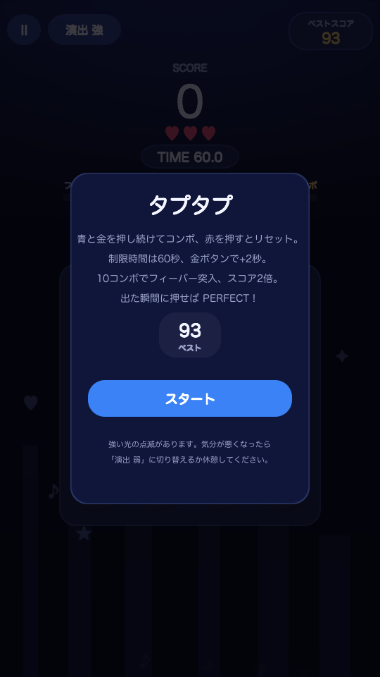
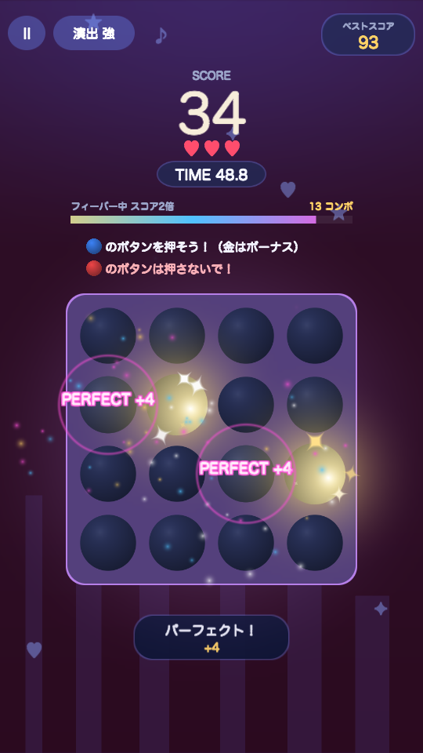
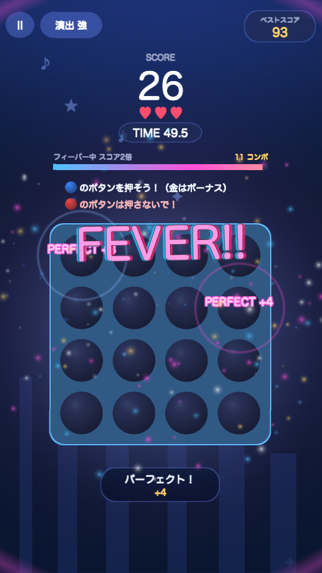
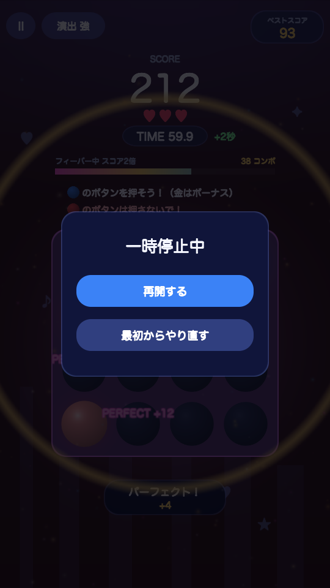
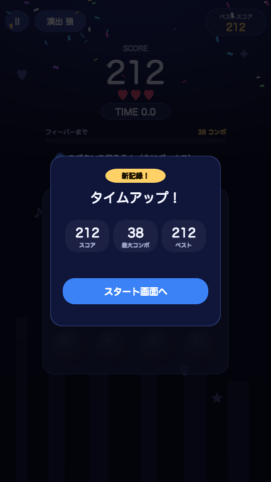

# タプタプ (Unity 版)

4×4 のボタンが光る反射神経ゲーム。HTML 版「タプタプ」を Unity 6.3 LTS (6000.3.25f1) で再実装したもの。

| スタート | プレイ中 (金ボタン) | フィーバー | 一時停止 | タイムアップ |
|:---:|:---:|:---:|:---:|:---:|
|  |  |  |  |  |

## 遊び方

- **青** を押す → +1、**金** を押す → +5 と残り時間 +2 秒
- **赤** を押すとライフ −1・コンボリセット (ライフ 3)
- 制限時間 60 秒。出た瞬間 (0.28 秒以内) に押すと PERFECT で +1
- 5 コンボごとにボーナス +1、10 コンボでフィーバー (7 秒間スコア 2 倍)
- スコアが上がるほど出現が速く・同時に多く・赤が多くなる
- 一時停止画面から「再開する」か「最初からやり直す」(スタート画面へ戻る) を選べる
- プレイ中は BGM が流れ、フィーバー中はハイハットと高音アルペジオが加わって盛り上がる
- ベストスコアと「演出 強/弱」設定は PlayerPrefs に保存

## 開き方

1. Unity Hub で `TapTap` フォルダを「Add project from disk」で追加し、6000.3.25f1 で開く
2. `Assets/Scenes/Main.unity` を開いて Play を押す
   (シーンが無い場合は初回起動時に自動生成される。メニュー **TapTap > メインシーンを作り直す** でも可)
3. Game ビューを縦長 (例: 1080×1920) にすると本番に近い見た目になる

## Mac アプリのビルド

メニュー **TapTap > Mac アプリをビルド** で `Builds/Mac/TapTap.app` が作られる。コマンドラインからは:

```bash
/Applications/Unity/Hub/Editor/6000.3.25f1/Unity.app/Contents/MacOS/Unity -batchmode -nographics -projectPath . -executeMethod TapTap.EditorTools.TapTapBuild.BuildMac -quit
```

## WebGL ビルド (unityroom 用)

WebGL Build Support モジュールが必要。メニュー **TapTap > WebGL をビルド (unityroom 用)** で `Builds/WebGL` に出力される
(540×960、Gzip 圧縮、Decompression Fallback なし)。unityroom の「WebGL アップロード」には `Builds/WebGL/Build/` の 4 ファイルを拡張子ごとに登録する。

| ファイル | unityroom の欄 |
|---|---|
| `WebGL.loader.js` | loader.js |
| `WebGL.data.gz` | data |
| `WebGL.framework.js.gz` | framework.js |
| `WebGL.wasm.gz` | wasm |

コマンドラインからは:

```bash
/Applications/Unity/Hub/Editor/6000.3.25f1/Unity.app/Contents/MacOS/Unity -batchmode -nographics -projectPath . -executeMethod TapTap.EditorTools.TapTapBuild.BuildWebGL -quit
```

## Unity Analytics

Unity Gaming Services の Analytics (`com.unity.services.analytics` 6.3.0) でプレイ状況を集計する。
ユニークユーザー (DAU/MAU)・新規プレイヤー・セッション数・セッション時間は SDK が自動で集計し、
ゲーム固有の数値は次のカスタムイベントで送る。

| イベント | パラメータ | 送るタイミング |
|---|---|---|
| `roundStarted` | `playCount` (integer) | スタートを押したとき |
| `roundEnded` | `result` (string: `clear` / `gameover` / `quit`), `score` (integer), `maxCombo` (integer), `playSeconds` (float), `livesLeft` (integer), `playCount` (integer) | タイムアップ (`clear`)、ライフ切れ (`gameover`)、一時停止から「最初からやり直す」(`quit`) |

- `playSeconds` は一時停止中を除いた 1 ラウンドの実プレイ時間
- スタート画面のボタンで送信をオフにできる (PlayerPrefs `taptap_analytics_consent`)。同意は Unity 6.3 の `EndUserConsent` API で SDK に伝える
- Unity Cloud のプロジェクトにリンクされていない場合は初期化に失敗するだけで、ゲームは普通に動く

### セットアップ

1. Unity エディタでプロジェクトを開き、**Edit > Project Settings > Services** でサインインして Unity Cloud のプロジェクトにリンクする
2. [Unity Cloud Dashboard](https://cloud.unity.com/) で **Analytics** を有効にする
3. **Analytics > Event Manager** で上の表の `roundStarted` / `roundEnded` を、同じパラメータ名・型で作成する (登録していないイベントは無効として破棄される)
4. ビルドし直してアップロードする

## 構成

画像・音声アセットは使っていない。スプライト・フォント・効果音・BGM はすべて実行時にコードで生成している。

| ファイル | 役割 |
|---|---|
| `Assets/TapTap/Scripts/TapTapGame.cs` | ゲームロジック、UI 構築、演出 (シェイク・スラム文字・フラッシュ等) |
| `Assets/TapTap/Scripts/UiFx.cs` | UI 上の火花・リング・紙吹雪パーティクル |
| `Assets/TapTap/Scripts/Sfx.cs` | 効果音のリアルタイム合成 (サイン/矩形/三角/ノコギリ波・ノイズ) |
| `Assets/TapTap/Scripts/PlayAnalytics.cs` | Unity Analytics の初期化・同意・カスタムイベント送信 |
| `Assets/TapTap/Scripts/Bgm.cs` | BGM の合成とループ再生 (128 BPM、通常とフィーバーの 2 レイヤー) |
| `Assets/TapTap/Scripts/Gfx.cs` | 生成スプライト、日本語 OS フォント読み込み、UI 部品ヘルパー |
| `Assets/TapTap/Editor/TapTapSetup.cs` | Main シーンの自動生成とビルド設定登録 |
| `Assets/TapTap/Editor/TapTapBuild.cs` | Mac / WebGL のビルド (メニュー / コマンドライン) |
| `Assets/Resources/Fonts/` | 同梱フォント M PLUS Rounded 1c Bold とライセンス |

## 補足

- 日本語はレガシー `Text` と同梱フォント [M PLUS Rounded 1c](https://fonts.google.com/specimen/M+PLUS+Rounded+1c) (SIL Open Font License 1.1、`Assets/Resources/Fonts/OFL.txt`) で表示する。WebGL では OS フォントが使えないため同梱している
- 強い光の点滅は 0.34 秒に 1 回までに制限している。「演出 弱」にするとフラッシュ・揺れ・パーティクルが控えめになる
